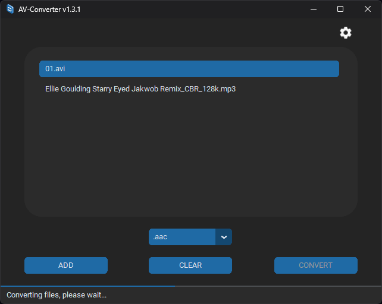

# AV-Converter

AV-Converter is a Python application designed for converting audio/video files using ffmpeg. 

## Installation

Grab the newest release here: [AV-Converter v1.3.1](https://github.com/paichiwo/av-converter/releases/tag/1.3)

1. Clone the repository: `git clone https://github.com/your/repository.git`

2. Install dependencies:
`pip install -r requirements.txt`

## Usage
To start AV-Converter, run the following command:
`converter.py`

## Adding Files
Drag and drop files onto the application or use the "ADD" button to browse and add files.  

## Conversion
- Select an output format from the dropdown menu.
- Click the "CONVERT" button to initiate the conversion process.
- Monitor progress through the progress bar and status updates.

## Settings
Click the settings icon to configure the output folder and other settings.

## Features
- Drag-and-drop: Add files by dragging them onto the application.
- Dynamic GUI: Uses custom tkinter widgets (CTk) for a responsive and interactive interface.
- Multithreaded Conversion: Converts files in parallel threads for efficiency.
- Settings Management: Save and load settings for output directory and ffmpeg options.

## Contributing
Contributions are welcome! If you have suggestions, improvements, or bug fixes, please follow these steps:

- Fork the repository.
- Create a new branch.
- Commit your changes.
- Push to the branch.
- Create a new Pull Request.

## License
This project is licensed under the MIT License.